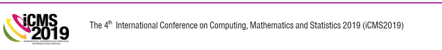

<link rel="stylesheet" href="styles.css" type="text/css">

 

  
Date:  
23 - 24 April 2019

Venue:  
Ombak Villa Resort, Langkawi Island, Malaysia

Theme:  
Discover Knew Knowledge Through Research  

  

   

## **R Workshop**   
**"Visualization of your tidy data"**  
**21 - 22 April 2019**  
**Ombak Villa Resort, Langkawi**  
  
In conjunction with the two conferences, the organising committee is conducting three parallel pre-conference workshops. For registration and further information please refer to the respective link given below.  

### **SPEAKER**  

| Matthias Templ, PhD |                                                                  |  
|:--------------------|:-----------------------------------------------------------------|  
|| Dr Matthias Templ is the owner of data analysis company OG. He obtained his PhD in Technical Mathematics from Vienna University of Technology and was an associate professor at the same university. Currently Dr Temple lectures at the Institute of Data Analysis and Process Design, Zurich University of Applied Sciences, Switzerland. He also holds a position as a consultant to the Palacký University Olomouc, Czech Republic. Dr Templ is a researcher at the Quality and Methods Unit at Statistics Austria. His other consultation works include for the World Bank and the OECD. His main research interest is in the area of imputation, statistical disclosure control, visualization, compositional data analysis, computational statistics, teaching in statistics and cluster analysis. He participated in many European research projects, to name one of those: the AMELI project for adequate estimation of poverty and social exclusion. Dr Templ has more than 280 scientific contributions in books, scientific journals and conferences as well as more than 40 papers in well-known indexed scientific journals.  He is the author and maintainer of several R packages for official statistics, such as the `sdcMicro` package for statistical disclosure control, the `VIM` package for visualization and imputation of missing values, the `simPop` package for synthetic population simulation, and the `robCompositions` package for robust analysis of compositional data. He is also a co-author to many other packages.  In addition, Dr. Matthias Templ is the editor-in-chief of the Austrian Journal of Statistics; associate editor for Springer’s Journal Wirtschafts-und Sozialstatistische Archiv; editor for the journal The Register; and on the editorial board of three other journals – JWARP journal, The Journal Transactions on Data Privacy, and the Journal Frontiers in Biomedical Physics |  
  

### **WHAT IS R?**  
open source; powerful and comprehensive platform for visualizing data, understanding and evaluating statistical models; programming language and software environment for statistical computing and graphics; ready to use for applications in data science, data analytics and for big data sets; participants expected to be able to use efficient R code and use R packages to perform data analytics after the workshop  

### **WHO SHOULD ATTEND?**  
Lecturers, Researchers, Engineers, Students, Industry Professionals and Scientists of any discipline who wish to explore R and Big Data.  
  
### **COURSE OUTLINE**  
We assume basic knowledge in R syntax, for example by doing the exercises of R package Swirl or a free course, e.g. on data camp in advance to this course. All topics are accompanied by practical exercises to be done by course participants themselves on their laptops.  
  
  
First day:  

- RStudio  

- Data Analysis with R, some basics and warm up  

- Tidy data and data manipulation with dplyr  

- The graphics package in R  

  
  
Second day:  

- Advanced data visualization with ggplot2  

- Mapping, Maps with ggmap and leaflet  

- Special graphics for special problems  

- Overview on interactive visualisation tools  

- Web applications with R shiny and markdown  

  

## Committee  
  
### International Scientific Committee  
  
SC Members|Institution
--|-------
Tudorel Andrei|National Institute of Statistics and Bucharest, University of Economic Studies, Bucharest, Romania  
Matthias Templ|Statistics Austria and Institute of Data Analysis and Process Design, Zurich University of Applied Sciences, Zurich Switzerland  
Ralf Munnich|University of Trier, Germany  
Risto Lehtonen|University of Helsinki, Finland  
Gergely Daroczi|Easystats Ltd, Budapest, Hungary  
Lucian Liviu Albu|Romanian Academy, Institute for Economic Forecasting, Bucharest, Romania  
Gheorghe Zaman|Romanian Academy, Institute of National Economy, Bucharest, Romania  
Valentina Vasile|Romanian Academy, Institute of National Economy, Bucharest, Romania  
Dorin Jula|Romanian Academy, Institute for Economic Forecasting and Ecological University of Bucharest, Romania  
Bogdan Oancea|University of Bucharest and National Institute of Statistics, Bucharest, Romania  
Monica Roman|Bucharest University of Economic Studies, Romania  
Nicoleta Caragea|National Institute of Statistics and Ecological University of Bucharest, Romania  
Antoniade-Ciprian Alexandru|Ecological University of Bucharest, Romania  
Adrian Dusa|University of Bucharest, Romania  
Elena Druica|University of Bucharest, Romania  
Nicolae-Marius Jula|Nicolae Titulescu University, Bucharest, Romania  
Ana Maria Dobre|National Institute of Statistics  
Gerald Cheang|University of South Australia, Australia  
Suhaidi Hassan|InterNetWorks Research Laboratory, Universiti Utara Malaysia, Malaysia  
Martin Everett|University of Manchester, UK  
Nicolaas Jan Dirk Nagelkerke|University of Amsterdam, Netherland  
Ang Miin Huey|Uiniversiti Sains Malaysia, Malaysia  
Poo Kuan Hoong|Senior Manager Data Science, AC Nielsen  
Nurhuda Ismail|Universiti Teknologi MARA, Malaysia  
  
  
### Organizing Committee (Universiti Teknologi MARA Kedah)  
  
Abd Razak Ahmad  
Amirah Hazwani Abd Rahim  
Anis Mardiana Ahmad  
Asmahani Nayan 
Fazillah Bosli  
Kamarul Ariffin Mansor  
Kartini Kassim  
Mohd Rijal Illias  
Kor Liew Kee  
Noor Hafizah Zainal Aznam  
Rosidah Ahmad  
Shahida Farhan Zakaria  
Siti Fairus Mokhtar   	
Wan Siti Esah Che Hussain  

 
  
## Contact Us  

For further enquiries,  

**E-mail:**  
      icms2019@uitm.edu.my  
  
**Phone:**  
      +604-456 2506 (Kor Liew Kee) (Publication)  
      +604-456 2406 (Asmahani Nayan) (General Inquiry)  
      +604-456 2445 (Noor Hafizah Zainal Aznam) (Payment)  
      +604-456 2408 (Kamarul Ariffin Mansor) (Workshop)  
  
**Address:**  
      Secretariat iCMS2019  
      Faculty of Computer and Mathematical Sciences  
      Universiti Teknologi MARA Kedah  
      Sungai Petani Campus  
      08400 Merbok  
      Kedah Darul Aman, MALAYSIA
   

## Disclaimer  

1.  All information submitted for the purpose of registration to the conference and fee payment will be treated with strict confidential.  

2.	UiTM and the organizing committee shall not be able to accept refund requests.  

3.	UiTM and the organizing committee shall not be responsible for information provided in this site on accommodation and tourism in Langkawi Malaysia. Kindly please check linked sites for regular updates.  

4.	All responsibilities on flights and accommodation bookings lie with the delegates. 
